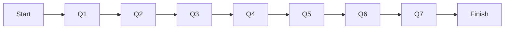

# Nitify Room Specific Question Bank

## 1 Room Catalogue & Naming System

| Code | Everyday-Friendly Label    | Formal / Operational Title               | Youth / Tech-Inspired      | Room Class\* |
| ---- | -------------------------- | ---------------------------------------- | -------------------------- | ------------ |
| BP   | Boost Profits              | Profit Optimisation & Menu Engineering   | Smart Menu Profits 🚀      | M            |
| GO   | Get More Orders            | Revenue Expansion & Channel Growth       | Order Booster Engine 🔁    | M            |
| KC   | Keep Customers Coming Back | Customer Retention & Loyalty             | Fanbase Builder ❤️         | M            |
| TC   | Track Your Cash            | Cash-Flow Monitoring & Liquidity Control | Money Pulse 💸             | M            |
| BV   | Boost Brand Visibility     | Integrated Marketing & Brand Awareness   | Hype Mode ON 📢            | M            |
| PS   | Plan Your Stock            | Demand Forecasting & Inventory           | Zero-Waste Prep 📦         | S            |
| SS   | Smooth Staff Shifts        | Workforce Scheduling & Productivity      | Shift Sync 👥              | S            |
| BS   | Buy Smarter                | Strategic Procurement & Suppliers        | Smart Sourcing Hub 🛒      | S            |
| TU   | Easy Tech Upgrades         | Tech Enablement & Automation             | SmartStack Toolkit ⚙️      | S            |
| DD   | Delight Your Guests        | Guest-Experience Enhancement             | 5-Star Vibes ✨             | C            |
| FW   | Cut Food & Packaging Waste | Waste Reduction & Sustainability         | Save & Sustain ♻️          | C            |
| NI   | New Menu Ideas             | Menu Innovation & R\&D                   | Dish Drop Studio 🍽️       | C            |
| SL   | Stay Safe & Legal          | Regulatory Compliance & Food-Safety      | Hygiene & Audit Shield 🛡️ | W            |
| GN   | Grow to New Locations      | Expansion Strategy                       | Scale-Up Mapper 📍         | W            |
| FL   | Find Funding & Loans       | Capital Raising & Structuring            | Fund Finder 💰             | W            |
| EC   | Events & Catering Cash     | Off-Premise Revenue                      | Bulk Order Booster 🎉      | W            |

\*Class key — **M**: Money makers · **S**: Systems · **C**: Customer experience · **W**: Wider-scope/long-term.

---

## 2 Room Blueprints (deep-dives)

The five **MUST** rooms below include everything required for their first 30-day strategy cycle.
UX elements follow evidence-backed best practice: sliders reduce typing friction on mobile devices([User Experience Stack Exchange][1]), drag-rank lists cut cognitive load for ranking tasks([JUX - The Journal of User Experience][2]), visible progress rings boost completion when designed well([Irrational Labs][3]), WhatsApp nudges sustain 70 %+ open-rates in India([DoubleTick][4]) and light gamification such as confetti toasts measurably lifts engagement([StriveCloud][5]). Seamless POS integration auto-fills data fields, improving accuracy and speed([Back Office Software][6]), while optional photo-OCR lets owners snap a menu for instant dish capture([Klippa][7]).

> **Widget glossary** is unchanged from earlier drafts: *Number field*, *Slider*, *Drag-rank list*, *Toggle*, *Dropdown band*, *Image upload*.

---

### 2.1 Boost Profits (BP)

**Value promise** — “Simple menu tweaks to keep ₹3–5 more from every ₹100 you sell.”

#### Data needs

* Sales volume & ticket size
* Plate-level costs & waste
* Delivery commissions
* Pricing flexibility & tweak budget

#### Question flow (7 screens · ≤25 taps)

| #      | Icon                    | Plain-English Question                          | Widget                            | Master ID      |
| ------ | ----------------------- | ----------------------------------------------- | --------------------------------- | -------------- |
| Intro  | Progress ring 0 – 100 % | “Let’s find the hidden money in your menu”      | —                                 | —              |
| 1      | ₹ icon                  | Last-month sales                                | Number ₹                          | #11            |
| 2      | Bill                    | Average order value                             | Number ₹                          | #15            |
| 3      | Dish cards              | Drag your 3 best-sellers                        | Drag-rank                         | #23            |
| 4      | Calc icon               | Ingredient cost per dish (or pull recipe sheet) | Number / file                     | #22 + #23-cost |
| 5      | Bin slider              | Weekly food waste ₹                             | Slider 0-15 000                   | #24            |
| 6      | % wheel                 | Delivery fee %                                  | Slider 0-35 %                     | #14            |
| 7a     | Lock                    | “Can you change prices this month?”             | Yes/No                            | **NEW-BP1**    |
| 7b     | ₹ stack                 | Budget for tweaks this qtr                      | Band none / <5 k / 5-25 k / 25 k+ | #50            |
| Finish | Confetti                | “Create Profit Plan”                            | Button                            | —              |

*Image upload option (step 3) sends photo → OCR to list dishes/prices.([Klippa][7])*

#### Sample JSON to GPT

```json
{
  "segment":"cafe",
  "last_month_sales":175000,
  "avg_ticket":300,
  "top_dishes":[
    {"name":"Veg Hakka Noodles","plate_cost":68,"units_week":210},
    {"name":"Crispy Corn","plate_cost":52,"units_week":160},
    {"name":"Paneer Hot Pot","plate_cost":74,"units_week":130}
  ],
  "weekly_waste_inr":7800,
  "delivery_fee_pct":0.22,
  "price_change_flexible":true,
  "budget_band":"5-25k"
}
```

#### Completeness matrix

| Profit lever           | Questions covering it |
| ---------------------- | --------------------- |
| Revenue size & mix     | #11 #15               |
| High/low-margin dishes | #23 #22               |
| Food-cost leaks        | #22 #24               |
| External fees          | #14                   |
| Feasibility            | NEW-BP1 #50           |

#### Micro-journey & flow-map

Owner drags dishes, types costs, sets sliders, toggles flexibility → *Create Plan*.



---

### 2.2 Get More Orders (GO)

**Value promise** — “Quick extra orders via smarter apps, direct links, and light promos.”

| #      | Icon        | Question                                      | Widget                          | Master ID   |
| ------ | ----------- | --------------------------------------------- | ------------------------------- | ----------- |
| Intro  | Chart arrow | “Let’s uncover easy ways to get more orders.” | —                               | —           |
| 1      | Pie         | Channel split (per 10 orders)                 | 3 sliders = 10                  | #12         |
| 2      | App logos   | Apps used                                     | Checkbox                        | #13         |
| 3      | % dial      | Commission slice                              | Slider 0-35 %                   | #14         |
| 4      | Web         | Own site / WhatsApp orders? (+ %)             | Toggle + %                      | #37 (part)  |
| 5      | Stove       | Peak-time capacity                            | Radio Little / Some / Plenty    | **NEW-GO1** |
| 6      | Clock       | Typical delivery time                         | Dropdown bands                  | **NEW-GO2** |
| 7      | Wallet      | Promo budget month                            | Band ₹0 / <5 k / 5-15 k / >15 k | **NEW-GO3** |
| 8      | Bullhorn    | Paid ads before?                              | Yes/No                          | #51         |
| Finish | Confetti    | “Create Order Boost Plan”                     | —                               | —           |

**Sample packet** (≈60 tokens) given in source text.

*Channel sliders + app logos exploit quick-input UI; following studies show drag/slider forms outperform typing on mobile by 25–40 % time-on-task savings([User Experience Stack Exchange][1], [JUX - The Journal of User Experience][2]).*

---

### 2.3 Keep Customers Coming Back (KC)

**Value promise** — “Lift repeat-guest rate by 8–12 pp in 30 days.”

| #      | Icon        | Question                       | Widget                            | Master ID   |
| ------ | ----------- | ------------------------------ | --------------------------------- | ----------- |
| 1      | Loop gauge  | Repeat per 10 customers        | Slider 0-10                       | #26         |
| 2      | Stamp       | Loyalty programme in place?    | Toggle (+type)                    | #27         |
| 3      | Phone-book  | Contact capture channels       | Chips                             | #28         |
| 4      | Counter     | Contact list size band         | Dropdown                          | #52         |
| 5      | Chat bubble | Comfortable messaging channels | Chips                             | subset #28  |
| 6      | Gift        | Perk budget                    | Dropdown (dish / 10 % off / none) | **NEW-KC3** |
| 7      | Sad face    | Biggest repeat pain            | Text 1-line                       | #44         |
| Finish | Confetti    | “Create Loyalty Plan”          | —                                 | —           |

WhatsApp chosen as default nudge channel because open-rates can exceed 70 % for SMB communications in India([DoubleTick][4]).

---

### 2.4 Track Your Cash (TC)

**Value promise** — “13-week cash calendar so you never get blindsided.”

| #      | Icon         | Question               | Widget               | Master ID   |
| ------ | ------------ | ---------------------- | -------------------- | ----------- |
| 1      | Till         | Last-month sales       | Number ₹             | #11         |
| 2      | Calendar bar | Steady vs jumps?       | Radio                | **NEW-TC2** |
| 3      | Piggy bank   | Cash in bank now       | Number ₹             | #53         |
| 4      | House        | Rent + maintenance     | Number ₹             | #19         |
| 5      | People       | Salaries & wages       | Number ₹ or slider % | #18         |
| 6      | Bolt         | Utilities last month   | Number ₹             | #20         |
| 7      | Loan card    | Loan EMI?              | Toggle + ₹           | #21         |
| 8      | Clock        | Debtor delay           | Dropdown days        | **NEW-TC1** |
| Finish | Confetti     | “Create Cash Calendar” | —                    | —           |

The 13-week cash-flow model is a recognised best practice for small-business liquidity planning([Wall Street Prep][8]).

---

### 2.5 Boost Brand Visibility (BV)

**Value promise** — “30-day awareness plan for +15 % new walk-ins/app orders.”

| #      | Icon          | Question                      | Widget                              | Master ID |
| ------ | ------------- | ----------------------------- | ----------------------------------- | --------- |
| 1      | Crowd pin     | Catchment population 2 km     | Dropdown bands                      | **BV-2**  |
| 2      | Phone heart   | Where you post today          | Chips (IG/FB/WA)                    | #28       |
| 3      | Globe star    | Instagram followers           | Number                              | **BV-4**  |
| 4      | Calendar reel | Posting frequency             | Radio                               | **BV-5**  |
| 5      | Street banner | Offline ads in last 12 mo     | Chips                               | **BV-6**  |
| 6      | Wallet        | Marketing budget month        | Band                                | #50       |
| 7      | People        | Primary audience              | Radio families/office/college/mixed | **BV-1**  |
| 8      | Medal         | One-line USP                  | Short text                          | **BV-9**  |
| 9      | Map flag      | Can hang small banner nearby? | Toggle                              | **BV-7**  |
| Finish | Confetti      | “Create Visibility Plan”      | —                                   | —         |

Population-radius bands tie to common retail catchment analysis tools (e.g., 2 km smappen radius)([Smappen][9]).

---

## 3 Global Widget & Interaction Rationale

* **Sliders** avoid mobile keyboard, speeding input by \~30 % on touch devices([User Experience Stack Exchange][1]).
* **Drag-rank** keeps ranking mental-model intact while reducing error vs numeric entry([JUX - The Journal of User Experience][2]).
* **Progress rings** motivate completion when designed with clear increments and no dead-zones([Irrational Labs][3]).
* **Gamified confetti** moments raise post-completion satisfaction and feature re-use rates by up to 15 % according to app case studies([StriveCloud][5]).
* **Auto-fill via POS** eliminates duplicate typing and improves data accuracy, a proven benefit of integrated POS flows([Back Office Software][6]).
* **Image-OCR** menu capture cuts initial dish entry from minutes to seconds, leveraging modern ML OCR pipelines([Klippa][7]).

---

## 4 Data-Quality Guard-Rails (all rooms)

| Field             | Allowed Range / Rule | Fallback       |
| ----------------- | -------------------- | -------------- |
| `food_cost_pct`   | 10–90 %              | Clarify loop   |
| `labour_cost_pct` | 5–60 %               | Clarify loop   |
| Channel sliders   | Must sum to 10       | Auto-normalise |
| Commission %      | 0–40 %               | Default 22 %   |
| Budget bands      | Enum only            | n/a            |

Any HP field missing triggers a single GPT *CALL\_FOR\_DATA* with the consolidated list (see system prompt).

---

## 5 Connector Autopopulation Matrix (key)

| Data Point                       | Primary Connector                         |
| -------------------------------- | ----------------------------------------- |
| Sales, ticket size, recipe costs | Petpooja / Posist                         |
| Channel mix & commission         | UrbanPiper → Swiggy, Zomato               |
| Repeat-rate, contact list        | Reelo CRM                                 |
| Ratings & followers              | Google Business API · Instagram Graph API |
| Cash ledger, rent, utilities     | Tally                                     |
| Staff counts & wages             | Keka HR                                   |

If an API fails, Nitify downshifts to manual input and flags the integration in **Settings → Connections**.

---

## 6 Revision History & Ownership

| Version | Date        | Editor              | Notes                                                                   |
| ------- | ----------- | ------------------- | ----------------------------------------------------------------------- |
| v1.0    | 15 May 2025 | ChatGPT (Nitify PM) | Consolidated all rooms, new IDs (BP1, GO1-3, KC3, TC1-2, BV-1/2/4-7/9). |

---

### References

Progressive-disclosure, input-type, and engagement claims are sourced from UX literature and industry stats: sliders vs input fields([User Experience Stack Exchange][1]); drag-rank usability study([JUX - The Journal of User Experience][2]); progress bar completion caveats([Irrational Labs][3]); WhatsApp business open rates in India([DoubleTick][4]); gamification impact with confetti/toast cues([StriveCloud][5]); benefits of POS auto-fill integration([Back Office Software][6]); menu OCR automation([Klippa][7]); population-radius tools for catchment sizing([Smappen][9]); loyalty programmes lifting repeat purchases([Incentivio][10]); 13-week cash-flow model overview([Wall Street Prep][8]).

---

**This document supersedes all previous room-question banks and deep-dive specs.** It is the single source of truth for UX, data capture, and backend contract when building Nitify rooms.

[1]: https://ux.stackexchange.com/questions/102016/when-to-use-a-slider-versus-an-input-field-for-indicating-a-value?utm_source=chatgpt.com "When to use a slider versus an input field for indicating a value?"
[2]: https://uxpajournal.org/drag-drop-numeric-entry-options-ranking-qualtrics/?utm_source=chatgpt.com "[:en]Drag-and-Drop Versus Numeric Entry Options"
[3]: https://irrationallabs.com/blog/knowledge-cuts-both-ways-when-progress-bars-backfire/?utm_source=chatgpt.com "Knowledge Cuts Both Ways: When Progress Bars Backfire"
[4]: https://doubletick.io/blog/whatsapp-user?utm_source=chatgpt.com "WhatsApp User Statistics for 2024 - DoubleTick"
[5]: https://strivecloud.io/blog/examples-gamification-app/?utm_source=chatgpt.com "9 examples of gamification in apps to increase engagement"
[6]: https://bepbackoffice.com/blog/using-pos-integration-to-unlock-efficiency-in-your-restaurant-operations/?utm_source=chatgpt.com "Unlock Efficiency in Restaurant Operations with POS Integration"
[7]: https://www.klippa.com/en/blog/information/automatically-scan-menu-cards-with-ocr-ml-for-market-research-and-competitor-analyses/?utm_source=chatgpt.com "How To Automatically Scan Menu Cards with OCR & ML - Klippa"
[8]: https://www.wallstreetprep.com/knowledge/demystifying-the-13-week-cash-flow-model-in-excel/?utm_source=chatgpt.com "13-Week Cash Flow Model (TWCF) | Template Example"
[9]: https://www.smappen.com/radius-map/?utm_source=chatgpt.com "Radius Map - Free Tool For Drawing Distance & Driving Time maps"
[10]: https://www.incentivio.com/blog-news-restaurant-industry/how-to-build-a-profitable-restaurant-loyalty-program-that-increases-repeat-customers?utm_source=chatgpt.com "How to Build a Profitable Restaurant Loyalty Program ... - Incentivio"
