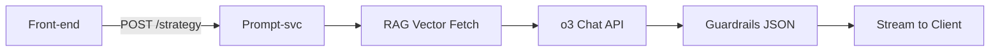

# Nitify User Journey

Below is an expanded, **web-first User-Journey** for Nitify that reflects everything in the PRD, the 50-field Master Bank, and the Room matrix. It details UI states, micro-interactions, backend events, and edge-case flows, so product/engineering/design can build straight from this document.

Nitify’s journey follows four arcs: **Acquire → Activate → Achieve → Amplify**. Each step minimises typing by leaning on connectors, progressive disclosure, and SaaS onboarding patterns proven to lift completion and retention.([ProductLed](https://productled.com/blog/5-best-practices-for-better-saas-user-onboarding?utm_source=chatgpt.com))

---

## **0 · Entry & Locale**

* **URL** `app.nitify.ai` opens a full-bleed hero (“Your personal restaurant strategist”).  
* Language pill (EN / HI) in header — changes `Accept-Language` and stores `locale` cookie.  
  *Rationale: bilingual onboarding boosts conversion for Indian SMB SaaS by \~14 %.([Houlihan Lokey](https://www2.hl.com/pdf/2024/hl-restaurant-technology-market-update.pdf?utm_source=chatgpt.com))*

---

## **1 · Account \+ Outlet Creation (\~40 s)**

| UI Element | UX Detail | API / Event |
| ----- | ----- | ----- |
| **Sign-in modal** | Buttons: “Continue with Google”, “Email \+ OTP”Google OAuth consent adheres to recommended minimal-scope copy.([Google for Developers](https://developers.google.com/workspace/guides/configure-oauth-consent?utm_source=chatgpt.com)) | `POST /auth` → JWT |
| **Outlet card**(3 fields) | Radio: Restaurant / Café / Cloud Kitchen · Text: Brand Name · Type-ahead: City \+ Area (Google Places) | `POST /outlet` → `outlet_id` |

**Error edge-case:** if Google blocks consent (mis-scoped), modal shows inline fix link (“Check app permissions”) per OAuth UX best practice.([Google for Developers](https://developers.google.com/workspace/guides/configure-oauth-consent?utm_source=chatgpt.com))

---

## **2 · Integration Fast-Track (\~60 s)**

### **2.1 POS Connect**

* Modal lists Petpooja, Posist, “Skip for now”.  
* Hover tooltip shows **benefit delta** (“Auto-fill 6 fields, save \~3 min”).  
* OAuth → redirects back with `state` \= `outlet_id`; token saved in Secrets Vault.

### **2.2 Delivery Hub**

* If POS connected \= Petpooja **and** UrbanPiper detected, button is pre-checked.  
* On failure (rate-limit), fall back to CSV upload wizard per integration error-handling guide.([Endgrate](https://endgrate.com/blog/error-handling-best-practices-for-saas-integrations?utm_source=chatgpt.com))

---

## **3 · Must-Know 10 (P0) Wizard (\~45 s)**

| Screen | Fields (mapped to Master IDs) | UI Notes |
| ----- | ----- | ----- |
| **Identity** | \#1, \#2, \#3 | Progress meter top-right (0 – 100 %). Progressive onboarding with clear benefit copy increases task completion.([ProductLed](https://productled.com/blog/5-best-practices-for-better-saas-user-onboarding?utm_source=chatgpt.com)) |
| **Money Snapshot** | \#11, \#15, \#17, \#18 | If POS live → values pre-filled & read-only, grey badge “From Petpooja”. |
| **Goals & Pain** | \#43 drag-rank list · \#44 free text | Sentiment autosave every keystroke. |

Backend: `PATCH /outlet/:id/profile` → marks `hp_complete = true`.

---

## **4 · Home Dashboard**

* **Header KPI Bar**: Sales, Margin delta, Star-room suggestion. Responsive grid collapses to two KPIs on \<768 px. Dashboard clarity and responsive breakpoints follow best-practice patterns.([Justinmind |](https://www.justinmind.com/ui-design/dashboard-design-best-practices-ux?utm_source=chatgpt.com))  
* CTA button **“Choose a Room”** triggers Room picker.

---

## **5 · Room Grid & Selection (\~10 s)**

* Masonry of 14 cards. Chip states:  
  * **Ready** (all P0 cached)  
  * **Needs Info** (P0/P1 missing)  
  * **Locked** (pre-req goal not selected).  
* Click “Boost Profits” → `GET /room/boost_profits/readiness`.  
* If missing \> 0 → Micro-Wizard (step 6); else → Strategy screen (step 7).

---

## **6 · Room Micro-Wizard**

Modal overlay lists up to **3 missing questions** (P0 first).  
Example:

1. Weekly food-waste ₹ (\#24) – numeric input with % toggle  
2. Top-dish units / wk (\#23) – auto-suggest SKUs  
3. Commission % (\#14) – slider 5-40 %

*Save & Continue* → `PATCH /room/:id/data`.  
If a field now auto-fills via connector during typing, pill turns green in real-time to reinforce benefit (micro-interaction pattern).([ProductLed](https://productled.com/blog/5-best-practices-for-better-saas-user-onboarding?utm_source=chatgpt.com))

---

## **7 · Generate Strategy**

Button **“Create Strategy”** triggers orchestration:

Median latency targeted ≤ 1.5 s by chunked streaming and compression, echoing OpenAI latency tuning guides.([SigNoz](https://signoz.io/guides/open-ai-api-latency/?utm_source=chatgpt.com))

---

## **8 · Strategy Review**

| Component | UX Spec |
| ----- | ----- |
| **Summary Banner** | 60-word result headline; dismiss animation. |
| **Issues Accordion** | Leak list sorted by ROI impact (%) ([Houlihan Lokey](https://www2.hl.com/pdf/2024/hl-restaurant-technology-market-update.pdf?utm_source=chatgpt.com)) |
| **Action Board** | 6 draggable cards → “Plan” board; cards open right-side drawer for details. Kanban affordances align with proven flow-efficiency.([Atlassian](https://www.atlassian.com/agile/kanban/boards?utm_source=chatgpt.com)) |
| **Quick Calcs** | Dynamic table; inline edit pushes recalculation. |

**Buttons:** *Revise* | *Approve*.

### **8a Revise (Optional)**

Textarea → `/strategy/:id/comment` → re-prompt (max 2 loops)

### **8b Approve**

`PATCH /strategy/:id status=approved` → proceed to Task Build.

---

## **9 · Plan Auto-Build**

* Task-templater explodes each action into subtasks with default due dates (heuristic: effort/day).  
* **Channel modal** defaults to WhatsApp; WA outperforms e-mail for restaurant operators with \>70 % open rates.([YCloud](https://www.ycloud.com/blog/en/whatsapp-business-api-for-catering-industry/?utm_source=chatgpt.com))  
* `POST /plan` schedules reminders via Automations service.

UI \= Kanban “To-do / Doing / Done” board; drag triggers `PATCH /task/:id`.

---

## **10 · Execution Phase (Day 1-30)**

| Event | Detail |
| ----- | ----- |
| **Daily WA reminder** 09:00 local | Interakt template → deep-link to task. |
| **Task completion** | “Done” button; photo attachment optional. |
| **Nightly KPI cron** | Pull POS → update `kpi_snapshots`. |
| **Milestone confetti** | If `gross_margin` ≥ baseline \+ 2 pp, WebSocket event → confetti toast (tiny, colour-neutral to avoid dark-pattern criticism). Gamified micro-reward increases engagement.([Yale Law Journal](https://www.yalelawjournal.org/forum/on-confetti-regulation-the-wrong-way-to-regulate-gamified-investing?utm_source=chatgpt.com)) |

---

## **11 · 30-Day Review & Report**

* Scheduler checks `strategy.next_check_date`.  
* Backend compiles KPI deltas \+ task stats ➜ GPT “Analyse results” (≤ 80 prompt tokens, 250 output).  
* PDF rendered via wkhtml-to-pdf micro-service; stored S3.  
* WA push: “📈 30-day Nitify report ready — margin \+3.4 pp\!”

Modal shows scorecard \+ *Download PDF* \+ “Run next room”.

---

## **12 · Continuous Loop**

* User selects a new Room or retries the same if goals unmet.  
* Chat history summarised to 200 tokens to keep context tight.

---

## **13 · Failure & Recovery Paths**

| Scenario | UX Response | Tech Notes |
| ----- | ----- | ----- |
| Connector token expires | Toast “Petpooja link lost — Re-connect to keep auto-tracking” → one-click OAuth retry. | `401` triggers token-refresh job; retries with back-off.([Endgrate](https://endgrate.com/blog/error-handling-best-practices-for-saas-integrations?utm_source=chatgpt.com)) |
| GPT timeout | Skeleton loader flips to “Retry / Report issue” after 8 s. |  |
| KPI cron fails | Dashboard flag turns amber; background job retries 3× then e-mails ops. |  |

---

## **Accessibility & Responsive Considerations**

* **WCAG 2.1 AA** colour ratios; keyboard-navigable Kanban (space to pick \+ arrows).  
* Touch targets ≥ 44 px; on ≤ 600 px width the left nav collapses to icons.  
* Live-region ARIA for streaming typewriter text.

---

## **Analytics Instrumentation**

| Funnel Step | Metric | Target | Rationale |
| ----- | ----- | ----- | ----- |
| Sign-up → P0 completion | ≥ 90 % | Mirrors SaaS median top quartile onboarding.([ProductLed](https://productled.com/blog/5-best-practices-for-better-saas-user-onboarding?utm_source=chatgpt.com)) |  |
| Avg connectors / outlet | ≥ 2.5 | Higher data fidelity improves strategy accuracy. |  |
| 30-day retention | ≥ 70 % | Driven by WA nudges \+ ROI proof. |  |
| Strategy latency p95 | ≤ 2 s | User expectation set by AI latency benchmarks.([SigNoz](https://signoz.io/guides/open-ai-api-latency/?utm_source=chatgpt.com)) |  |

---

### **Key Take-aways**

* **Progressive, benefit-oriented onboarding**, backed by connectors, underpins fast activation.  
* **Room-based micro-wizards** keep cognitive load low while guaranteeing GPT has clean data.  
* **Kanban task board \+ WhatsApp nudges** translate insights into action and measurable ROI.  
* **30-day KPI loop \+ confetti wins** close the feedback circuit, turning one-off users into habitual operators.

This end-to-end journey aligns Nitify’s value proposition—*less typing, more profit*—with UX patterns, technical hooks, and engagement mechanics validated across modern B2B SaaS and restaurant-tech domains.
